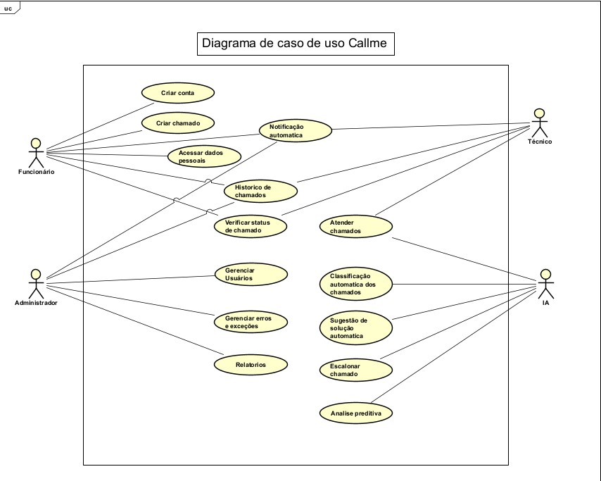

<h1 align="center">
  
  <br>
  Callme App
</h1>

<p align="center">🚀 O futuro do atendimento com inteligência artificial</p>

<div align="center">

[]()
[]()
[]()
[]()

</div>

---

## 📖 Sobre o Projeto  

O **Callme App** é um aplicativo mobile para **abertura e gerenciamento de chamados** por funcionários para a assistência técnica, com suporte integrado de **IA**.  

🔹 Funcionários abrem chamados no app.  
🔹 A **IA** recebe o chamado e sugere uma solução imediata.  
🔹 Caso não seja resolvido, o chamado é **encaminhado automaticamente ao técnico responsável**.  

O desenvolvimento foi feito com **React Native + TypeScript**, utilizando **Scrum** como metodologia ágil.  

> 🎯 Motivação: A ideia surgiu devido à insatisfação com softwares existentes que não oferecem integração com inteligência artificial.  

---

## 🛠️ Tecnologias Utilizadas  

- [React Native](https://reactnative.dev/)  
- [TypeScript](https://www.typescriptlang.org/)  
- [Node.js](https://nodejs.org/pt)  
- [Android Studio](https://developer.android.com/studio)  
- [Astah UML](https://astah.net/products/astah-uml/)  
- [Trello](https://trello.com/)  

---

## 📂 Estrutura do Repositório  

- **/Callme/Modelagem_de_Requisitos** → Diagramas, backlog, casos de uso  
- **/Callme/PIM** → Documentação acadêmica (PIM 3º semestre)  
- **/Callme/code** → Código-fonte do app  

---

## 🗒️ Documentação  

- [📌 Diagramas UML](https://github.com/Nilo40/AtividadeEgydio/Callme/Modelagem_de_Requisitos/Diagrama_de_caso_de_uso_sistema_corrigido.asta)  
- [📌 Sprint Backlog](https://github.com/Devluisgsouza/Callme_App/blob/main/Callme/Modelagem_de_Requisitos/Sprints_Backlog.docx)  
- [📌 Casos de Uso](https://github.com/Devluisgsouza/Callme_App/blob/main/Callme/Modelagem_de_Requisitos/Descrição_caso_de_uso.docx)  
- [📌 Documentação Completa](https://github.com/Devluisgsouza/Callme_App/blob/main/Callme/PIM/PIM%203%20SEMESTRE.doc)  



# Cronograma de Sprints - TCC Análise de Sistemas

| Sprint | Período       | Objetivos Principais                                    | Entregáveis                              |
|--------|---------------|--------------------------------------------------------|-----------------------------------------|
| 1      | Semana 1      | Planejamento do projeto e definição do tema            | Documento de escopo e planejamento      |
| 2      | Semana 2      | Levantamento e análise de requisitos                    | Documento de requisitos                  |
| 3      | Semana 3      | Modelagem do sistema (diagramas UML, arquitetura)      | Diagramas UML e especificação técnica   |
| 4      | Semana 4      | Desenvolvimento do protótipo ou sistema                 | Protótipo funcional ou código inicial   |
| 5      | Semana 5      | Testes, validação e documentação final                  | Relatório de testes e documentação final|


---

## 🚀 Como Rodar o Projeto  

### Pré-requisitos  
- [Android Studio](https://developer.android.com/studio)  
- [Node.js](https://nodejs.org/pt)  
- [Expo CLI](https://expo.dev/)  

### Passo a passo  

```bash
# Clone o projeto
$ git clone https://github.com/Devluisgsouza/Callme_App.git 

# Entre no diretório
$ cd Callme/code

# Instale as dependências
$ npm install

# Instale o Expo CLI (caso não tenha)
$ npm install -g expo-cli

# Inicie o projeto
$ npx expo start

```bash
    # Conectar o código ao emulador android
    $ npm run android
```
